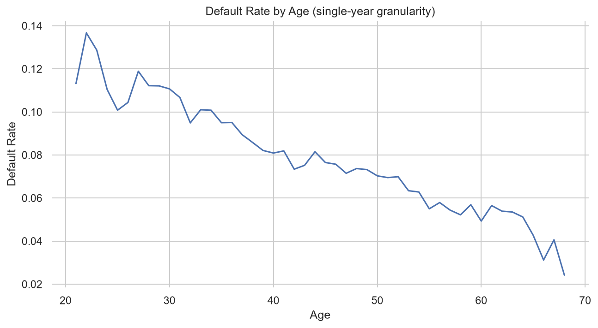
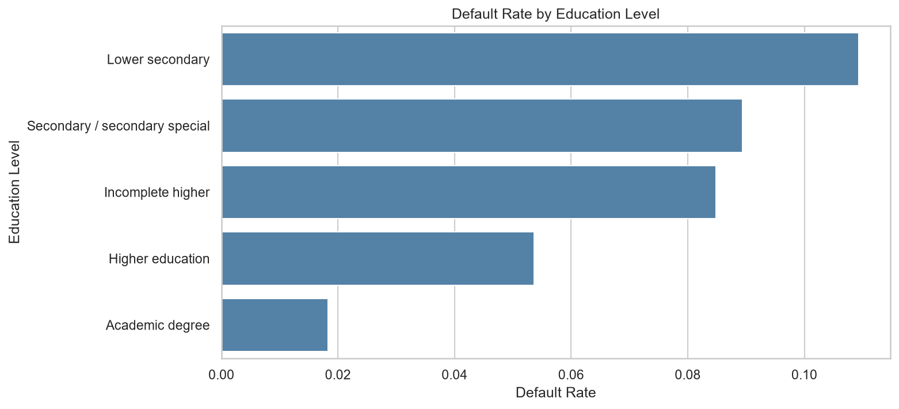
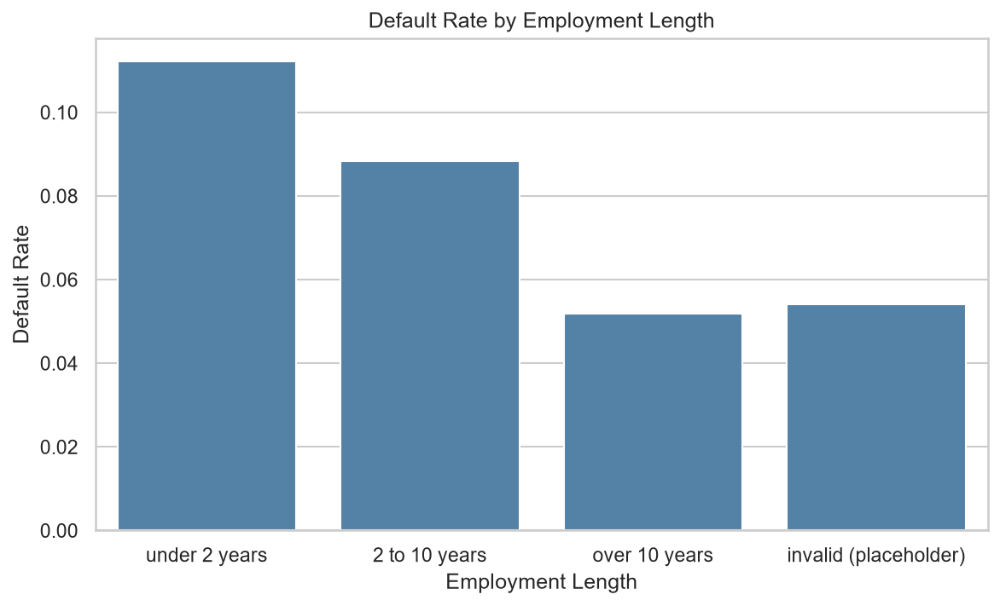
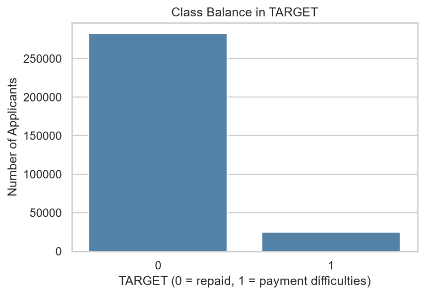
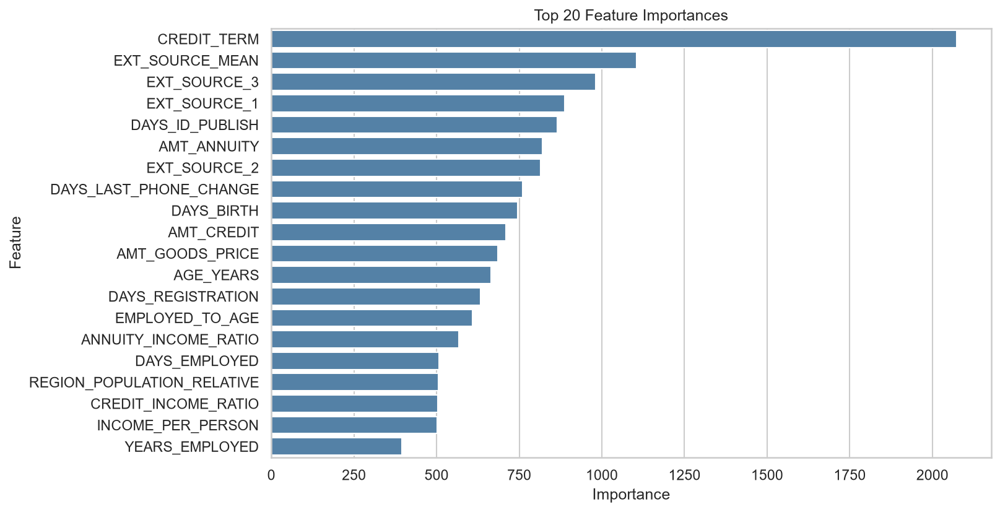

# Loan Default Risk Analysis & Prediction

## Problem Statement
Which applicant and credit-history features most reliably predict loan default, and can a model meaningfully outperform a simple baseline?

## Data Source
[Home Credit Default Risk (Kaggle)](https://www.kaggle.com/competitions/home-credit-default-risk), using `application_train.csv` only.
- 307,511 loan applications, 122 columns
- Binary target `TARGET`: 1 = client had payment difficulties, 0 = repaid on time
- Imbalanced: 8.1% defaulted (24,825) vs. 91.9% repaid (282,686)

## Tech Stack
Python, MySQL, SQL, Pandas, NumPy, Matplotlib, Seaborn, scikit-learn, LightGBM, Jupyter Notebook, Git

## Approach
1. Loaded the raw data into a local MySQL database
2. Explored default rates by income, age, education, employment length, and loan-to-income ratio using SQL queries
3. Visualized the key patterns (Matplotlib / Seaborn)
4. Cleaned the data: fixed the `DAYS_EMPLOYED` placeholder value (365243) and dropped columns more than 60% empty
5. Engineered 8 features (age and tenure in years, credit/income, annuity/income, credit term, income per person, employed-to-age ratio, mean of the three external credit scores)
6. Split into train/test (80/20, stratified) and imputed missing values using train medians only, to avoid data leakage
7. Built a logistic regression baseline and a LightGBM model, then tuned LightGBM with early stopping on a validation split
8. Evaluated on the untouched test set with AUC-ROC, since accuracy is misleading on imbalanced data

## Key Results

| Model | Test AUC-ROC |
|---|---|
| Logistic regression (baseline) | 0.750 |
| LightGBM (first version) | 0.764 |
| LightGBM (tuned, early stopping) | **0.770** |

- Test set: 61,503 applicants. Validation AUC (0.770) matched the test AUC, so the gain is not an artifact of tuning on the test set.
- A model that predicts "no default" for everyone would be 91.9% accurate but useless, which is why AUC-ROC is the metric.

## Key Findings

- **Age is a strong predictor.** Default rate is roughly 2x higher for under-30 applicants (11.5%) vs. 55+ (5.3%). At single-year granularity, it declines steadily from ~13.5% at age 21 to ~2.5% at age 68. Ages with fewer than 50 applicants were filtered out of the chart because their rates were noisy.
- **Employment length shows the same pattern.** Default rate is roughly 2x higher for applicants employed under 2 years (11.2%) vs. over 10 years (5.2%). The "invalid" placeholder group (likely retirees) defaults at 5.4%, similar to long-tenured applicants.
- **Education shows the cleanest trend.** Default rate falls from 10.9% (lower secondary) to 5.4% (higher education). The "academic degree" group (1.8%) has only 164 applicants, so it is too small a sample to trust.
- **Income is not a clean predictor.** High-income applicants default least (7.1%), but mid-income applicants default slightly more than low-income applicants (8.6% vs. 8.2%).
- **Loan-to-income ratio doesn't show the expected pattern either.** Mid-ratio applicants (2-5x income) default most (8.7%), while low and high ratios are both lower (~7.4%). A possible reason is selection bias: lenders may apply stricter approval standards to high-ratio applicants.
- **The model relies on external credit scores and loan repayment structure.** The most-used features were the engineered `CREDIT_TERM` (annuity / credit) and `EXT_SOURCE_MEAN`. All 8 engineered features ranked in the top 20. `CREDIT_TERM` has near-zero linear correlation with default (+0.01) yet ranked first, so the model is capturing a non-linear pattern.

## Charts

## Charts











## Limitations & Next Steps
- Only `application_train.csv` was used. The linked bureau and previous-application tables would likely add +0.01 to +0.02 AUC.
- Feature importance counts splits, so it shows what the model used, not the direction or cause of an effect.
- Income and loan-to-income buckets are broad. Finer or continuous views may show more.
- Missing values were median-imputed for the baseline; LightGBM handles them natively.
- Planned: a Power BI dashboard summarizing default risk by applicant segment, and a Kaggle leaderboard submission.

## Project Structure
```
notebooks/01_analysis.ipynb   # SQL exploration, EDA, cleaning, modeling
src/load_data.py              # loads the CSV into MySQL
images/                       # charts used in this README
```

## How to Run
1. Clone this repo and run `pip install -r requirements.txt`
2. Download `application_train.csv` from the Kaggle link above into `/data`
3. Create a MySQL database named `credit_risk`
4. Create a `.env` file in the project root containing `DB_PASSWORD=your_mysql_password` (it is git-ignored)
5. Run `python src/load_data.py` to load the data into MySQL
6. Run the notebook in `/notebooks` from top to bottom
